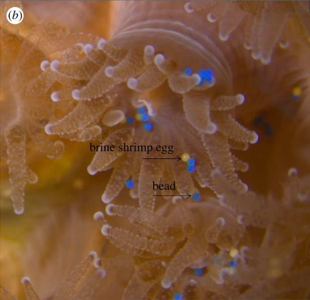
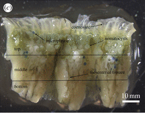

```{r setup, include=FALSE}
knitr::opts_chunk$set(
	echo = TRUE,
	warning = FALSE,
	comment = "##",
	prompt = FALSE,
	tidy = TRUE,
	tidy.opts = list(width.cutoff = 75),
	fig.path = "img/"
)
```

***

#Introduction

***

Astraniga pocualta is a faculatively symbiotic coral species that is Native to New England. Its capabilities to live with or without zoozanthaellie is that makes this organism faculatively symbiotic and thus a model organism for studying coral bleaching. 
</br>

This study focuses on looking at how microplastics are affecting Astrangia poculata. 



##Methodology 

Colonies of wild Astrangia poculata were collected and decalcified, they were then opened up to allow for the gastrocavity to be analyzed. They counted the amount of microplastics that they found represented by Figure 1 below. They also divided the colonies into top, middle and bottom to see which portions of the coral had the greatest amount of microplastics shown by Figure 2 below. 



Following this, Rotjan et al. wanted to see how feeding microsplastics to colonies of Astrangia poculata will affect the amount of copepods, brine shrimp, and brine shrimp eggs that they would eat 15 minutes after. They ran t-tests, a permuation tests, and a paired permutation test to see if there was any significance between these experiments.   
  
##Getting data from excel into R

***

These are the packages that you will need to run my replication assignment.
I used the function called readxl to pull my dad in from the excell file that I have been working from. 
```{r, results='hide', error=FALSE, warning=FALSE, message=FALSE}
library(knitr)
library(readxl)
library(readxl)
library(ggplot2)
library(dplyr)
library(gridExtra)
```

***

#Figure 1

***

##To start, you need to pull in the data from R. 

```{r}
Figure_1 <- read_excel("individual_project.xlsx", 
    sheet = "GP-Fig.1")
head(Figure_1)
```

##Creating a plot in ggplot

```{r,fig.width=4,fig.height=4}
ggplot(data=Figure_1,aes(x=MP_type,y=MP_count))+geom_boxplot()+xlab("Plastic Type")+ylab("no. plastics per polyp")+scale_y_continuous(lim=c(0,100),breaks=c(0,20,40,60,80,100))+theme_classic()+annotate("text", x = "Beads", y = 30, label = "A")+annotate("text", x = "Fibers", y = 92, label = "B")+annotate("text", x = "Misc", y = 22, label = "A")+theme(axis.text.x = element_text(angle = 45, hjust = 1))
```

***

#Figure 2

***

##Pulling data in from Excel 
```{r}
Figure_2 <- read_excel("individual_project.xlsx", 
    sheet = "GP-Fig.2")
head(Figure_2)
```

##Using ggplot to create Figure 2

```{r, fig.width=5,fig.height=4}
plot_2 <- ggplot(Figure_2, aes(x=colony,y=MP_ingested))
plot_2 + geom_histogram(stat="identity",aes(fill=location))+annotate("text", x = 1, y = 100, label = "57.5%")+annotate("text", x = 2, y = 135, label = "74.7%")+annotate("text", x = 3, y = 19, label = "88.6%")+scale_y_continuous(lim=c(0,250),breaks=c(0,50,100,150,200,250))
```

***

#Figure 3

***

##pulling data in from excel
```{r}
Figure_3 <- read_excel("individual_project.xlsx", 
     sheet = "GP-Fig.3")
head(Figure_3)
```

##Using ggplot to create Figure 3 
```{r, fig.width=3,fig.height=4}
ggplot(data=Figure_3,aes(x=intake,y=particles_consumed))+geom_boxplot()+xlab("")+ylab("particles consumed (mm^3)")+scale_y_continuous(lim=c(0,3),breaks=c(0,1,2,3))+theme_classic()+theme(axis.text.x = element_text(angle = 45, hjust = 1))
```

***

#Figure 4 

***

##Plot 1!

```{r}
Fig.4_plot.1 <- read_excel("individual_project.xlsx", 
    sheet = "GP-Fig.4-Cope")
head(Fig.4_plot.1)
```

```{r,fig.width=4,fig.height=4}
Figure_4_plot_1 <- ggplot(Fig.4_plot.1, aes(x=treatment,y=copepods))
copepods <- Figure_4_plot_1 + geom_violin()+theme_classic()
copepods
```

***

##Plot 2 from figure 4

```{r}
Fig.4_plot.2 <- read_excel("individual_project.xlsx", 
    sheet = "GP-Fig.4-Brine")
head(Fig.4_plot.2)
```


```{r,fig.width=4,fig.height=4}
Figure_4_plot_2 <- ggplot(Fig.4_plot.2, aes(x=treatment,y=brine))
brine <- Figure_4_plot_2 + geom_violin()+theme_classic()
brine
```

***

##Plot 3 from figure 4

```{r}
Fig.4_plot.3 <- read_excel("individual_project.xlsx", 
    sheet = "GP-Fig.4-Egg")
summary(Fig.4_plot.3)
```


```{r,fig.width=4,fig.height=4}
Figure_4_plot_3 <- ggplot(Fig.4_plot.3, aes(x=treatment,y=eggs))
eggs <- Figure_4_plot_3 + geom_violin()+theme_classic()
eggs
```

***

##Adding all three together
```{r, fig.width=3,fig.height=8}
grid.arrange(copepods, brine, eggs)
```

#Statistical Analysis

#t-test between plot 1 and 2 of figure 4.

```{r}
x <- qqnorm(Fig.4_plot.1$copepods)
x
```


***

#Figure 5

***

```{r}
Figure_5 <- read_excel("individual_project.xlsx", 
    sheet = "GP-Fig.5")
summary(Figure_5)
plot(Figure_5)
```

##Using ggplot to create Figure 5.

```{r}
plot_5 <- ggplot(Figure_5, aes(x="brine shrimp egg ingestion (mm^3)",y="Microplastic Ingestion (mm^3)"))
plot_5 + geom_jitter() + theme_classic()
```


#Limitations
* In Figure_2 I was unable to move the legend to the top, I would do this in photo shop if I had access to the application.
* I ran my violin plots with the data that I was given and found that my results were not as amplified as the ones shown in the paper. 
