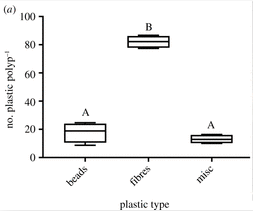
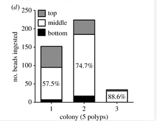
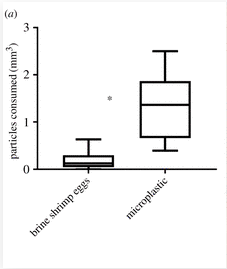
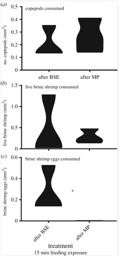
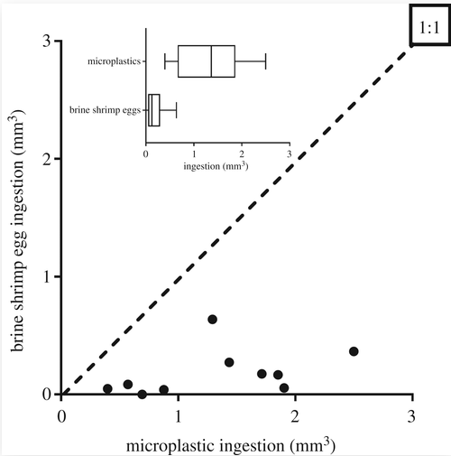

```{r setup, include=FALSE}
knitr::opts_chunk$set(
	echo = TRUE,
	warning = FALSE,
	comment = "##",
	prompt = FALSE,
	tidy = TRUE,
	tidy.opts = list(width.cutoff = 75),
	fig.path = "img/"
)
```

***

#Introduction

***

Astraniga pocualta is a faculatively symbiotic coral species that is native to New England. Its capabilities to live with or without zoozanthaellie is what makes this organism faculatively symbiotic and thus a model organism for studying coral bleaching. 
</br>

This study focuses on looking at how microplastics are affecting Astrangia poculata. 


##Methodology 

Colonies of wild Astrangia poculata were collected and decalcified, they were then opened up to allow for the gastrocavity to be analyzed. Rotjan et al. counted the amount of microplastics that they found represented by Figure 1 below. They also divided the colonies into top, middle and bottom to see which portions of the coral had the greatest amount of microplastics shown by Figure 2 below.


Following this, Rotjan et al. wanted to see how feeding microsplastics to colonies of Astrangia poculata will affect the amount of copepods, brine shrimp, and brine shrimp eggs that they would eat 15 minutes after. They ran t-tests, a permuation tests, and a paired permutation test to see if there was any significance between these experiments.   

##Getting data from excel into R

***

These are the packages that you will need to run my replication assignment.
I used the function called readxl to pull my dad in from the excell file that I have been working from. 
```{r, results='hide', error=FALSE, warning=FALSE, message=FALSE}
library(knitr)
library(readxl)
library(readxl)
library(ggplot2)
library(dplyr)
library(gridExtra)
library(dplyr)
library(ggpubr)
library(wPerm)
library(lmPerm)
```

***

#Figure 1

***

##To start, you need to pull in the data from R. 

```{r}
Figure_1 <- read_excel("individual_project.xlsx", 
    sheet = "GP-Fig.1")#I made my own sheets in the excel doc. 
head(Figure_1)
```

##Creating a plot in ggplot

```{r,fig.width=4,fig.height=4}
ggplot(data=Figure_1,aes(x=MP_type,y=MP_count))+geom_boxplot()+xlab("Plastic Type")+ylab("no. plastics per polyp")+scale_y_continuous(lim=c(0,100),breaks=c(0,20,40,60,80,100))+theme_classic()+annotate("text", x = "Beads", y = 30, label = "A")+annotate("text", x = "Fibers", y = 92, label = "B")+annotate("text", x = "Misc", y = 22, label = "A")+theme(axis.text.x = element_text(angle = 45, hjust = 1))  
```




***

#Figure 2

***

##Pulling data in from Excel 
```{r}
Figure_2 <- read_excel("individual_project.xlsx", 
    sheet = "GP-Fig.2")
head(Figure_2)
```

##Using ggplot to create Figure 2

```{r, fig.width=5,fig.height=4}
plot_2 <- ggplot(Figure_2, aes(x=colony,y=MP_ingested))
plot_2 + geom_histogram(stat="identity",aes(fill=location))+annotate("text", x = 1, y = 100, label = "57.5%")+annotate("text", x = 2, y = 135, label = "74.7%")+annotate("text", x = 3, y = 19, label = "88.6%")+scale_y_continuous(lim=c(0,250),breaks=c(0,50,100,150,200,250))
```



***

#Figure 3

***

##pulling data in from excel
```{r}
Figure_3 <- read_excel("individual_project.xlsx", 
     sheet = "GP-Fig.3")
head(Figure_3)
```

##Using ggplot to create Figure 3 
```{r, fig.width=3,fig.height=4}
ggplot(data=Figure_3,aes(x=intake,y=particles_consumed))+geom_boxplot()+xlab("")+ylab("particles consumed (mm^3)")+scale_y_continuous(lim=c(0,3),breaks=c(0,1,2,3))+theme_classic()+theme(axis.text.x = element_text(angle = 45, hjust = 1))
```




***

#Figure 4 

***

##Plot 1!

```{r}
Fig.4_plot.1 <- read_excel("individual_project.xlsx", 
    sheet = "GP-Fig.4-Cope")
head(Fig.4_plot.1)
```

```{r,fig.width=4,fig.height=4}
Figure_4_plot_1 <- ggplot(Fig.4_plot.1, aes(x=treatment,y=copepods))
copepods <- Figure_4_plot_1 + geom_violin()+theme_classic()
copepods
```

***

##Plot 2 from figure 4

```{r}
Fig.4_plot.2 <- read_excel("individual_project.xlsx", 
    sheet = "GP-Fig.4-Brine")
head(Fig.4_plot.2)
```


```{r,fig.width=4,fig.height=4}
Figure_4_plot_2 <- ggplot(Fig.4_plot.2, aes(x=treatment,y=brine))
brine <- Figure_4_plot_2 + geom_violin()+theme_classic()
brine
```

***

##Plot 3 from figure 4

```{r}
Fig.4_plot.3 <- read_excel("individual_project.xlsx", 
    sheet = "GP-Fig.4-Egg")
summary(Fig.4_plot.3)
```


```{r,fig.width=4,fig.height=4}
Figure_4_plot_3 <- ggplot(Fig.4_plot.3, aes(x=treatment,y=eggs))
eggs <- Figure_4_plot_3 + geom_violin()+theme_classic()
eggs
```

***

##Adding all three together
```{r, fig.width=3,fig.height=8}
grid.arrange(copepods, brine, eggs)
```




##Statistical Analysis

### Normality tests between plot 1 figure 4.

```{r}
ggqqplot(Fig.4_plot.1$copepods)
```

```{r}
shapiro.test(Fig.4_plot.1$copepods)
```

***

From this output we can say that the data is normal by looking to see if all of the data points fall within the shaded region and that the p-value of the shapiro test is above .05. This is the same result that the paper recieved.  

***

```{r}
tt <- t.test(copepods~treatment,data=Fig.4_plot.1,var.equal=TRUE)
tt
```

***

I ran a t-test on the same data that Rotjan et al. used and recieved the same p-value of .3. This does not show significance. 

***

###Statistical analysis from plot 2 figure 4

```{r}
ggqqplot(Fig.4_plot.2$brine)
```

```{r}
shapiro.test(Fig.4_plot.2$brine)
```

***

I received a p-value that is below .05 in my shapiro wilks test, showing that the data is not normal. This is what the replication paper also stated. I also found that the data does not pass the visual test with my plot. The paper ran a t-test for this sample shown below.   

***

```{r}
tt2 <- t.test(brine~treatment,data=Fig.4_plot.2,var.equal=TRUE)
tt2
```

I got the same value for my t-test as they did in the paper of .6, this shows to not be significant as the paper also said. I do not think that it is okay to run a t-test with non-normal data. so here is my attempt at a permutation test below. 

```{r}
p2 <- aovp(brine ~ treatment, data=Fig.4_plot.2)
summary(p2)
```

I struggled to get the correct p-value for this single permutation test. I am not sure if I did this correctly. 

###Statistical Analysis from plot 3 figure 4

```{r}
shapiro.test(Fig.4_plot.3$eggs)
```

```{r}
ggqqplot(Fig.4_plot.3$eggs)
```

***

This data is also not normal as we see an outlier in the visual test and we also see that the p-value is less than .05 for the shapiro wilks test. The paper states that when the data did not show normality from a shapiro wilks test they used a paired permutation test.

***

```{r}
p3 <- aovp(eggs ~ treatment, data=Fig.4_plot.3)
summary(p3)
```

Same result as above, I was not able to properly get the permutation test result that the paper received. I think it has something to do with my code but I could not figure it out unfortunately. 

***

#Figure 5

***

```{r}
Figure_5 <- read_excel("individual_project.xlsx", 
    sheet = "GP-Fig.5")
summary(Figure_5)
```

##Using ggplot to create Figure 5.

```{r}
plot_5 <- ggplot(Figure_5, aes(x=microplastic_ingestion,y=bse_ingestion))+xlab("brine shrimp egg ingestion (mm^3)")+ylab("Microplastic Ingestion (mm^3)")
plot_5 + geom_point() + theme_classic()
```



##Statistics for figure 5

***

I ran the same paired permutation test that they ran in the paper and got the same results as they did! I know that we were only supposed to run one analysis of statistics but I struggled to figure out how to do single permutation tests but am very pleased that I was able to properly run this test and I think that it worked as well!

***

```{r}
perm.paired.loc(Figure_5$microplastic_ingestion, Figure_5$bse_ingestion, mean, variable = NULL,
                alternative = c("two.sided", "less", "greater"),
                R = 9999)
```


***

#Results

I found that I was able to create most of the graphical figures with some minor differences. With figure 5 I ran out of time to finish the last plot that is embedded into the top left corner. I also ran almost all of the statistics that the paper ran and found that I got the same p-values for the t-test and the paired permutation test, but I struggled to understand how they got the permutation tests to work for figure 4, plot 2 and 3. 

#Discussion 

To start I want to look at my figure 4 with all of my plots stacked on top of each other. I found that my plot 3 looks exaclty like the papers, but my first and second plot look much different. I plotted the first two the same exact way that I did the third plot so I do not understand why my first two plots look so different. The paper talks about the statistics of these plots but they do not address very much about the plots themselves, so this change does would not affect the overall results of the paper as I recieved the same p-value for both of these images. The images published in the paper definitely provide a much better visual that make the statistical results easier to understand, so maybe they made them look different some how to allow for them to properly get the statistical point across. There is also the potential that I messed something else up as well..

Another thing that I would like to discuss is that all of the data had a n value that is lower than 30. This would be considered a small sample and after re-looking through the modeules online I found that it is common for statisticians to use a different test for normality when dealing with sample sizes that have an n value that is less than 30. An example of this would be the gossets distribution. I am sure that this came into mind when the authors of this paper were analyzing their data but it is just a thought that I had about the way that they ran their statistics and I wonder if that would have changed the results. 

***

#Limitations
* In my Figure_2 I was unable to move the legend to the top, I would do this in photo shop if I had access to the application.
* I ran my violin plots with the data that I was given and found that my results were not as amplified as the ones shown in the paper. 
* I was unable to get a proper p value from my permutation tests. 
* Since the sample size is smaller than 30, maybe they should have run different statistics. 
* I was not able to fully finish figure 5 due to a lack of time.
* Thank you for a great semester! 

